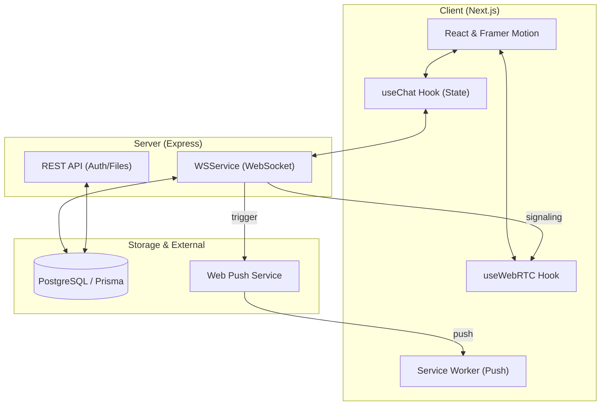
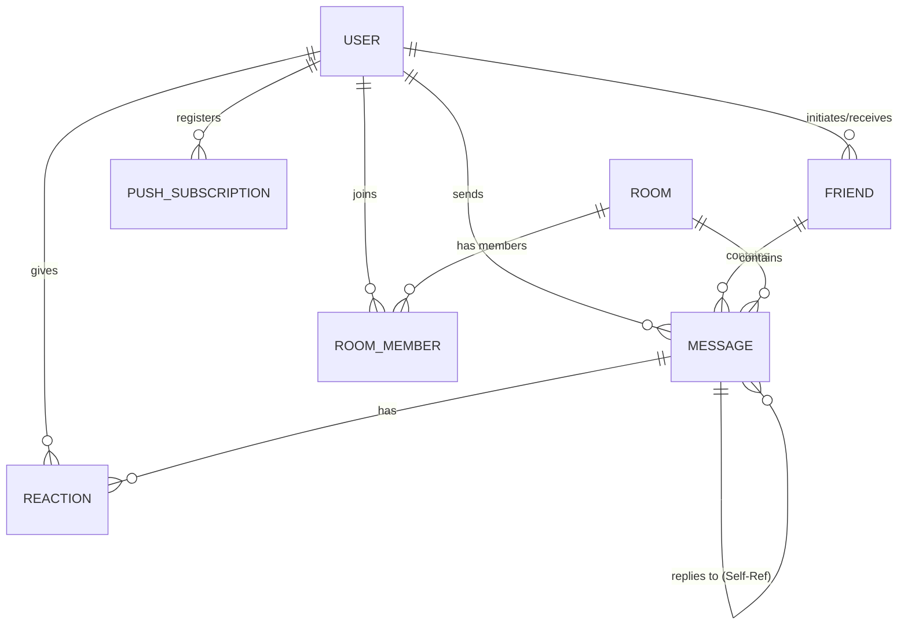
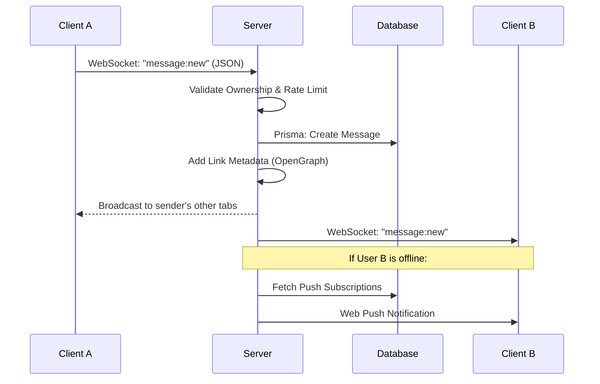
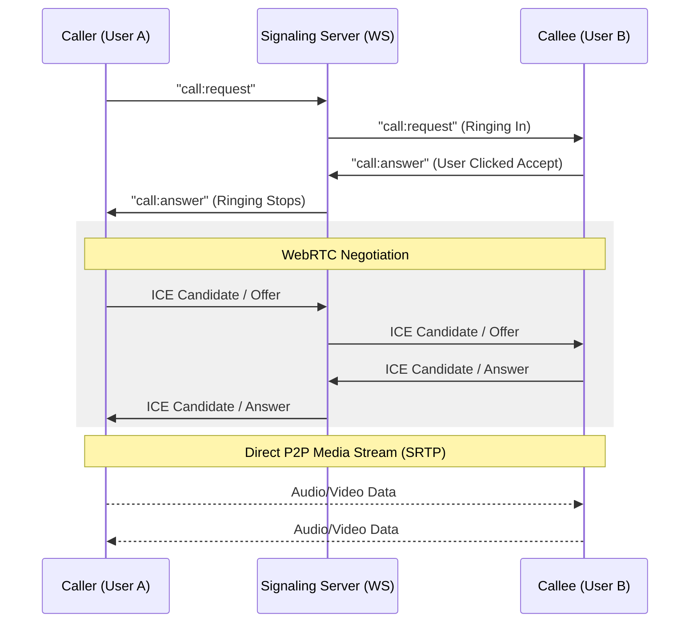

# Chatr Architecture & Data Flows

This document provides a technical overview of how Chatr works under the hood. Understanding these patterns is essential for full-stack system design and interview preparation.

---

## 🏗 System Overview

Chatr follows a modern full-stack architecture with a clear separation between the persistent state (Database), the business logic (Server), and the presentation layer (Client).

### Key Components:
- **Client (Next.js)**: A React-based frontend using the App Router. It manages real-time state via custom hooks (`useChat`, `useWebRTC`) and handles UI responsiveness with Framer Motion.
- **Server (Express)**: A Node.js backend that serves two roles:
    1. **REST API**: Handles CRUD operations for authentication, file uploads, and historical data fetching.
    2. **WebSocket Server**: Powers the real-time engine for messaging, status updates, and WebRTC signaling.
- **ORM (Prisma)**: Acts as the bridge between TypeScript and the PostgreSQL database, providing type-safe queries and easy migrations.

---

## � Database Schema (ER Model)

The database is designed to handle flexible communication patterns, supporting both direct 1-on-1 chats and group rooms.

### Core Models:
- **`User`**: Stores identity, credentials (hashed), and relationships.
- **`Friend`**: Represents a 1-on-1 connection status (PENDING/ACCEPTED) between two users.
- **`Message`**: The central entity. It can belong to either a `Friend` (DM) or a `Room` (Group). Supports attachments and self-referencing for replies.
- **`Reaction`**: Allows users to attach emojis to messages.
- **`PushSubscription`**: Stores Web Push credentials linked to a user's browser for offline notifications.

---

## �💬 Real-Time Messaging Flow

Chatr uses **WebSockets** for instant message delivery instead of traditional HTTP polling.

### 1. Connection & Authorization
- When the client mounts, it establishes a WebSocket connection using a **JWT** stored in a secure cookie.
- The server validates the token and maps the `Socket ID` to the `User ID`.

### 2. The Message Lifecycle

---

## 📞 WebRTC Calling Flow (Signaling)

Peer-to-peer (P2P) connections cannot be established without a "matchmaker." Chatr uses the WebSocket server as a **Signaling Server**.

---

## 🔒 Security & Performance Features

### 🛡 Security
- **JWT Authentication**: Uses session tokens for stateless authorization.
- **HttpOnly Cookies**: Prevents client-side scripts from accessing tokens, mitigating XSS risks.
- **Rate Limiting**: The WebSocket server monitors message frequency to prevent DoS attacks and spam.
- **Input Sanitization**: All user-generated content is sanitized to prevent injection attacks.

### 🚀 Performance
- **Optimistic UI**: The client updates the UI immediately while the message is still being sent to the server.
- **Pagination (Infinite Scroll)**: Historical messages are fetched in chunks to keep initial load times low.
- **Memory Pruning**: The client keeps only the most recent 500 messages in memory per chat to prevent memory leaks on long-lived sessions.
- **WebSocket Reconnections**: Automatic exponential backoff reconnection logic ensures a stable experience on flakey networks.
